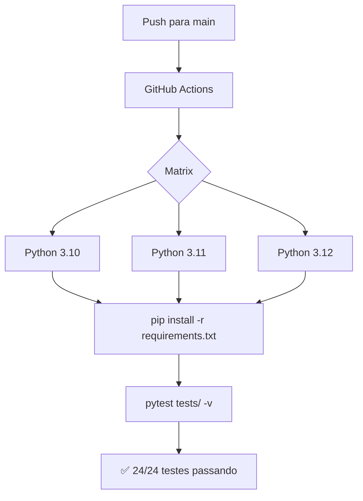

# ☁️ Nano-IaaS

[](https://github.com/Liucera/nano-iaas/actions/workflows/tests.yml)
[](https://www.python.org/downloads/)
[](https://opensource.org/licenses/MIT)
[](https://github.com/psf/black)

> Framework leve de Infrastructure-as-Code focado em **leitura de dados multi-cloud** via terminal Linux (WSL2).

---

## 🎯 FILOSOFIA

| Princípio | Implementação |
|-----------|---------------|
| **Read-only by design** | Zero risco de destruição de dados |
| **Provider-agnostic** | Mesma CLI para AWS, GCP e Azure |
| **WSL2-native** | Otimizado para Windows Subsystem for Linux |
| **Terminal-first** | Tudo via CLI, sem GUIs |

---

## 🚀 INSTALAÇÃO (WSL2)

```bash
# 1. Clone o repositório
git clone https://github.com/Liucera/nano-iaas.git
cd nano-iaas

# 2. Crie o ambiente virtual
python3 -m venv .venv
source .venv/bin/activate

# 3. Instale as dependências
pip install -e .

CONFIGURAÇÃO:

AWS (S3 REAL)

# Configure suas credenciais AWS
aws configure
# Access Key ID: [sua chave]
# Secret Access Key: [sua chave secreta]
# Region: us-east-1
# Output: json

GCP E AZURE (MOCKS)
NÃO PRECISA DE CONFIGURAÇÃO! OS PROVIDERS MOCK FUNCIONAM SEM CREDENCIAIS.

USO:
LISTAR RECURSOS:

# AWS S3 - buckets reais
nano-iaas list aws

# GCP Cloud Storage - mock
nano-iaas list gcp

# Azure Blob Storage - mock
nano-iaas list azure

# Local filesystem
nano-iaas list local

LER DADOS:

# AWS S3 → JSON (auto-detect)
nano-iaas read s3://meu-bucket/dados/users.jsonl --limit 10

# GCP Mock → JSON
nano-iaas read gs://nano-iaas-dev/dados/users.jsonl

# Azure Mock → CSV
nano-iaas read azure://nano-iaas-data/dados/metrics.csv --format csv

# Local → JSON
nano-iaas read tests/data/users.jsonl

# Local → CSV
nano-iaas read tests/data/metrics.csv --format csv

GERENCIAR PERFIS:

# Ver configuração atual
nano-iaas config show

# Ativar profile
nano-iaas config activate dev

ARQUITETURA:

nano-iaas/
├── core/                    # Abstrações
│   ├── provider.py          # Interface CloudProvider (ABC)
│   ├── data_reader.py       # Motor de conversão JSON/CSV/Parquet
│   └── config.py            # Gerenciador de perfis multi-cloud
├── providers/               # Implementações
│   ├── local/               # Filesystem local
│   ├── aws/                 # AWS S3 (boto3 - real)
│   ├── gcp/                 # Google Cloud Storage (mock)
│   └── azure/               # Azure Blob Storage (mock)
├── cli/                     # Interface terminal
│   ├── main.py              # Entry point
│   └── commands/            # read, list, config
├── tests/                   # Testes automatizados
│   ├── test_data_reader.py
│   ├── test_local_reader.py
│   ├── test_config.py
│   └── test_cli.py
└── .github/workflows/       # CI/CD
    └── tests.yml            # GitHub Actions

AUTENTICAÇÃO:

| Cloud | Método        | Comando WSL2                            |
| ----- | ------------- | --------------------------------------- |
| AWS   | SSO / Profile | `aws sso login`                         |
| GCP   | ADC           | `gcloud auth application-default login` |
| Azure | CLI           | `az login`                              |

TESTES:

# Rodar todos os testes
pytest tests/ -v

# Com cobertura
pytest tests/ --cov=core --cov=providers --cov=cli

Status: ✅ 24/24 testes passando em Python 3.10, 3.11 e 3.12
 
📋 PASSO A PASSO DO DESENVOLVIMENTO:

Etapa 1: Estrutura Base

[x] Criar diretórios (core/, providers/, cli/, tests/)
[x] Configurar ambiente virtual Python
[x] Instalar dependências (Click, boto3, pandas, rich, etc.)

Etapa 2: Core

[x] CloudProvider (ABC) - interface base
[x] DataReader - conversão entre formatos
[x] ConfigManager - perfis multi-cloud via YAML

Etapa 3: Provider Local

[x] Leitura de arquivos JSONL, CSV
[x] Listagem de diretórios
[x] Metadados de arquivos

Etapa 4: Provider AWS (S3 Real)

[x] Autenticação com boto3
[x] Listagem de buckets
[x] Leitura de objetos S3
[x] Testado com conta AWS real

Etapa 5: Mocks GCP e Azure

[x] GCSReaderMock - simula Google Cloud Storage
[x] BlobReaderMock - simula Azure Blob Storage
[x] Usa arquivos locais como dados mock

Etapa 6: CLI

[x] Comando read - leitura de dados
[x] Comando list - listagem de recursos
[x] Comando config - gerenciamento de perfis
[x] Auto-detect de provider pelo prefixo (s3://, gs://, azure://)
[x] Tabelas coloridas com Rich

Etapa 7: Testes Automatizados

[x] Testes para DataReader
[x] Testes para LocalReader
[x] Testes para ConfigManager
[x] Testes para CLI
[x] 24 testes, todos passando

Etapa 8: CI/CD

[x] GitHub Actions configurado
[x] Testes em Python 3.10, 3.11, 3.12
[x] Badge de status no README

ETAPA 9: CORREÇÃO DO ERRO NO CI

## 🔧 Correção do CI/CD — Passo a Passo

### Problema
O pipeline falhava com `numpy==2.4.5` incompatível com Python 3.10.

### Causas encontradas
1. `.venv` (Python 3.12) estava commitado no repositório
2. Workflow usava `pip install` hardcoded, ignorando o `requirements.txt`
3. Arquivos de dados de teste bloqueados pelo `.gitignore`

---

### Passo 1 — Remover o `.venv` do repositório
```bash
echo ".venv/" >> .gitignore
git rm -r --cached .venv
git add .gitignore
git commit -m "ci: remove .venv do repositório"
```

### Passo 2 — Corrigir o `requirements.txt`
```txt
numpy>=1.24,<2.3
```

### Passo 3 — Corrigir o workflow
```yaml
- name: Install dependencies
  run: |
    python -m pip install --upgrade pip
    pip install -r requirements.txt
```

### Passo 4 — Incluir arquivos de teste
```bash
echo "!tests/**/*.csv"   >> .gitignore
echo "!tests/**/*.jsonl" >> .gitignore
git add -f tests/data/users.jsonl tests/data/metrics.csv
git commit -m "ci: adiciona arquivos de dados de teste"
```

---

### Resultado
| Python | Status |
|--------|--------|
| 3.10   | ✅ 24/24 |
| 3.11   | ✅ 24/24 |
| 3.12   | ✅ 24/24 |


## Pipeline de CI




ROADMAP

| Versão | Feature                    | Status    |
| ------ | -------------------------- | --------- |
| v0.2.0 | Provider GCP real          | 🔜 Futuro |
| v0.2.0 | Provider Azure real        | 🔜 Futuro |
| v0.3.0 | Streaming entre clouds     | 🔜 Futuro |
| v0.3.0 | Suporte a Parquet completo | 🔜 Futuro |
| v0.4.0 | API REST                   | 🔜 Futuro |


CONTRIBUIÇÃO:

Contribuições são bem-vindas! Para contribuir:
Fork o projeto
Crie uma branch (git checkout -b feature/nova-feature)
Commit suas mudanças (git commit -m 'feat: adiciona nova feature')
Push para a branch (git push origin feature/nova-feature)
Abra um Pull Request

LICENÇA:

Este projeto está licenciado sob a licença MIT - veja o arquivo LICENSE para detalhes.

👨‍💻 AUTOR:
 Liucera - GitHub

💡 Dica WSL2: Para usar o nano-iaas de qualquer lugar no terminal, adicione ao seu .bashrc:
bash
Copy
alias nano-iaas="~/nano-iaas/.venv/bin/nano-iaas"

---


### Design Patterns Utilizados

- **Abstract Base Class (ABC):** Interface `CloudProvider` que todos os providers implementam
- **Factory Pattern:** Dicionário `PROVIDERS` que mapeia strings para classes
- **Generator Pattern:** Métodos `read()` retornam `Iterator` para streaming de dados
- **Unix Philosophy:** Output em stdout permite pipes com `jq`, `grep`, `awk`
