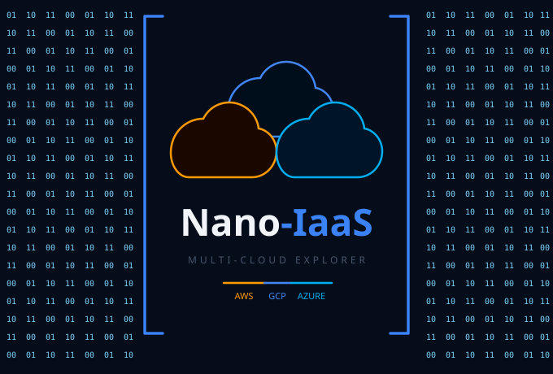

<div align="center">
  
  
  # Nano-IaaS
  
  **Dashboard multi-cloud para leitura e auditoria de dados**
  
  [](https://api.nano-iaas.com.br/docs)
  [](https://app.nano-iaas.com.br/)
  [](https://python.org)
  [](https://fastapi.tiangolo.com)
  [](LICENSE)

  [Acessar Dashboard](https://app.nano-iaas.com.br/) | [API Docs](https://api.nano-iaas.com.br/docs)
</div>

---


## Status Beta

MVP em fase Beta/QA. O projeto usa frontend no GitHub Pages com dominio proprio e backend em AWS ECS Fargate + ALB. O certificado HTTPS da API e emitido pelo AWS ACM e validado por DNS no Registro.br.

Dominios planejados:
- Dashboard: https://app.nano-iaas.com.br
- API Docs: https://api.nano-iaas.com.br/docs

Registros DNS necessarios no Registro.br:
- `app.nano-iaas.com.br` como CNAME para `Liucera.github.io`.
- `api.nano-iaas.com.br` como CNAME para o DNS do ALB retornado em `terraform/aws-infra` pelo output `alb_dns_name`.
- CNAME de validacao do ACM retornado pelo output `acm_dns_validation_records` apos `terraform apply`.

Para ativar HTTPS no ALB depois que o ACM estiver validado:

```bash
cd terraform/aws-infra
terraform apply -var="enable_https=true"
```

---

## O que e o Nano-IaaS?

O **Nano-IaaS** e uma plataforma web de leitura e auditoria de dados multi-cloud. Permite que equipes acessem dados armazenados em **AWS S3**, **Google Cloud Storage** e **Azure Blob Storage** em uma unica interface segura, sem precisar de acesso direto as clouds.

> Read-only by design - nenhuma operacao de escrita ou delecao e permitida.

---

## Funcionalidades

- Multi-cloud - AWS, GCP e Azure em uma interface so
- Autenticacao JWT - login seguro com token de acesso
- Dashboard visual - visualizacao de buckets e containers
- Leitura de dados - suporte a JSON, JSONL, CSV e LOG
- Auditoria completa - registro de quem acessou o que e quando
- HTTPS - comunicacao criptografada de ponta a ponta
- Deploy na nuvem - AWS ECS Fargate + ALB (backend) + GitHub Pages (frontend)

---

## Tecnologias

| Camada | Tecnologia |
|---|---|
| Backend | Python 3.12 + FastAPI |
| Autenticacao | JWT (python-jose + passlib) |
| CLI | Click + Rich |
| AWS | boto3 |
| GCP | google-cloud-storage |
| Azure | azure-storage-blob |
| Frontend | HTML + CSS + JavaScript |
| Deploy Backend | AWS ECS Fargate + ALB |
| Deploy Frontend | GitHub Pages |
| CI/CD | GitHub Actions |

---

## Como rodar localmente

### Pre-requisitos
- Python 3.12+
- Git
- WSL2 (recomendado no Windows)

### Instalacao

```bash
git clone https://github.com/Liucera/nano-iaas.git
cd nano-iaas
python3 -m venv venv
source venv/bin/activate
pip install -r requirements.txt
pip install -e .
```

### Rodando o backend

```bash
uvicorn web.backend.main:app --reload
```

### Rodando o frontend

```bash
python3 -m http.server 3000 --directory docs
```

Acesse: http://localhost:3000

Credenciais padrao:
- Usuario: admin
- Senha: definida pelo administrador

---

## CLI

```bash
nano-iaas list gcp
nano-iaas list azure
nano-iaas list aws
nano-iaas read gs://nano-iaas-dev/dados/
nano-iaas config set
```

---

## Autor

Arlindo Barroso - Estudante de Provisionamento de Servicos Computacionais (CLOUD) pelo CAPACITA IREDE

GitHub: https://github.com/Liucera

---

## Licenca

Este projeto esta sob a licenca MIT.
