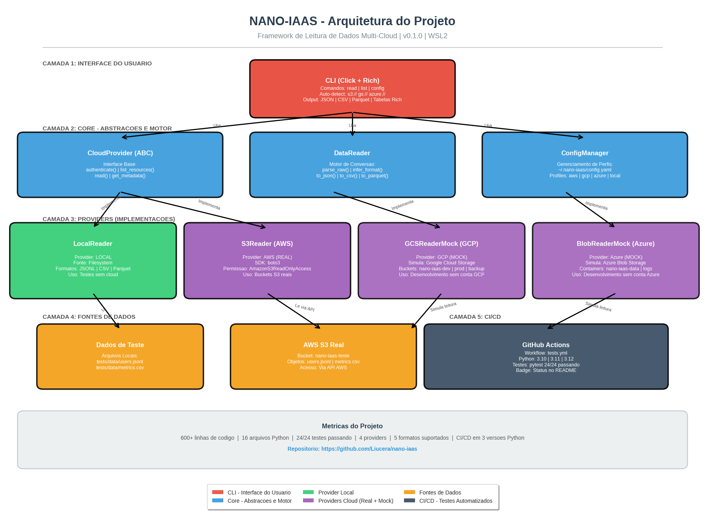

<div align="center">
  
  
  # Nano-IaaS
  
  **Dashboard multi-cloud para leitura e auditoria de dados**
  
  [](https://web-production-87d4d.up.railway.app)
  [](https://liucera.github.io/nano-iaas/)
  [](https://python.org)
  [](https://fastapi.tiangolo.com)
  [](LICENSE)

  [🚀 Acessar Dashboard](https://liucera.github.io/nano-iaas/) • [📖 API Docs](https://web-production-87d4d.up.railway.app/docs)
</div>

---

## 📌 O que é o Nano-IaaS?

O **Nano-IaaS** é uma plataforma web de leitura e auditoria de dados multi-cloud. Permite que equipes acessem dados armazenados em **AWS S3**, **Google Cloud Storage** e **Azure Blob Storage** em uma única interface segura, sem precisar de acesso direto às clouds.

> 💡 **Read-only by design** — nenhuma operação de escrita ou deleção é permitida.

---

## ✨ Funcionalidades

- ☁️ **Multi-cloud** — AWS, GCP e Azure em uma interface só
- 🔒 **Autenticação JWT** — login seguro com token de acesso
- 📊 **Dashboard visual** — visualização de buckets e containers
- 📁 **Leitura de dados** — suporte a JSON, JSONL, CSV e LOG
- 📋 **Auditoria completa** — registro de quem acessou o quê e quando
- 🔐 **HTTPS** — comunicação criptografada de ponta a ponta
- 🚀 **Deploy na nuvem** — Railway (backend) + GitHub Pages (frontend)

---

## 🖥️ Screenshot

> Dashboard mostrando recursos das 3 clouds com auditoria em tempo real

---

## 🛠️ Tecnologias

| Camada | Tecnologia |
|---|---|
| Backend | Python 3.12 + FastAPI |
| Autenticação | JWT (python-jose + passlib) |
| CLI | Click + Rich |
| AWS | boto3 |
| GCP | google-cloud-storage |
| Azure | azure-storage-blob |
| Frontend | HTML + CSS + JavaScript |
| Deploy Backend | Railway |
| Deploy Frontend | GitHub Pages |
| CI/CD | GitHub Actions |

---

## 🚀 Como rodar localmente

### Pré-requisitos
- Python 3.12+
- Git
- WSL2 (recomendado no Windows)

### Instalação

```bash
